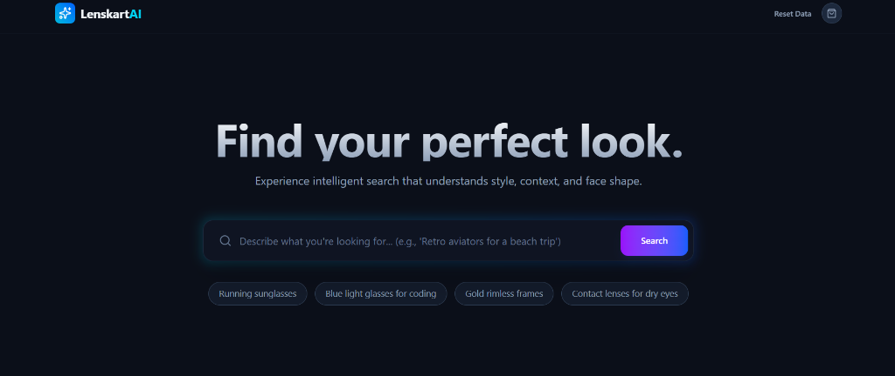

# 👓 Lenskart AI - Contextual Search Platform

An intelligent, full-stack search engine built for Lenskart that goes beyond keywords to understand user intent. It combines **Vector Search**, **Behavioral Re-ranking**, and **AI Explanations** to deliver a premium e-commerce search experience.

 
*(Note: Add a screenshot of your UI here)*

---

## 🚀 Features

### 1. **Contextual Semantic Search**
   - Understands natural language queries like *"blue light glasses for coding"* or *"trendy sunglasses for a beach vacation"*.
   - Uses **Local AI Embeddings (@xenova/transformers)** (all-mpnet-base-v2, 768d) for zero-latency, private, and cost-free vector generation.

### 2. **Hybrid & Active Filtering**
   - Combines Vector similarity with structured MongoDB filters.
   - **Filters**: Category (Sunglasses, Eyeglasses, etc.) and Price Range.
   - Filters are applied *post-vector search* to ensure strict adherence to user preferences.

### 3. **AI-Powered "Why this result?"**
   - Every product card features a **"Why this result?"** button.
   - Uses Generative AI to explain *why* a specific product matches the user's search query (e.g., *"Matches your request for 'coding' because it features blue-light blocking lenses..."*).

### 4. **Learning-to-Rank (LTR)**
   - The system learns from user behavior to improve rankings over time.
   - **Boosting Logic**:
     - 🛒 **Purchase**: +5 Score
     - 🛍️ **Add to Cart**: +3 Score
     - 🖱️ **Click**: +1 Score
     - ⏱️ **High Dwell Time (>60s)**: +1 Score

### 5. **High-Performance Ingestion Pipeline**
   - Capable of ingesting **thousands of products** in minutes.
   - Automatically normalizes raw CSV data into structured MongoDB documents with vector embeddings.

---

## 🛠️ Tech Stack

- **Frontend**: React, TypeScript, Tailwind CSS, Framer Motion (for smooth animations).
- **Backend**: Node.js, Express, TypeScript.
- **Database**: MongoDB Atlas (with Vector Search Index).
- **AI/ML**: 
    - **Embeddings**: `Xenova/all-mpnet-base-v2` (Local, ONNX).
    - **Generative AI**: Google Gemini Pro (for explanations).

---

## ⚙️ Setup Instructions

### Prerequisites
- Node.js (v18+)
- MongoDB Atlas Account (Free Tier)
- Google Gemini API Key

### 1. Clone & Install
```bash
git clone https://github.com/your-username/lenskart-ai-search.git
cd lenskart-ai-search

# Install Backend Dependencies
npm install

# Install Frontend Dependencies
cd client
npm install
cd ..
```

### 2. Environment Configuration
Create a `.env` file in the root directory:
```env
PORT=3000
MONGO_URI=your_mongodb_connection_string
GEMINI_API_KEY=your_gemini_api_key
EMBEDDING_MODEL=embedding-001  # Legacy, we use Local now but keep compatible
```

### 3. MongoDB Atlas Setup
1. Create a Cluster.
2. Create a Database `test` and Collection `products`.
3. Create a **Vector Search Index** on the `products` collection named `vector_index`:
```json
{
  "fields": [
    {
      "type": "vector",
      "path": "embedding",
      "numDimensions": 768,
      "similarity": "cosine"
    }
  ]
}
```

### 4. Run the Project
You need two terminals.

**Terminal 1 (Backend):**
```bash
npx ts-node src/server.ts
```

**Terminal 2 (Frontend):**
```bash
cd client
npm run dev
```

### 5. Ingest Data
1. Open the app at `http://localhost:5173`.
2. Click the **"Reset Data"** button in the top right corner.
3. This will trigger the backend to:
   - Generate realistic Lenskart-specific data (300 products).
   - Generate local embeddings.
   - Upload everything to MongoDB.

---

## 📂 Project Structure

```
├── client/                 # React Frontend
│   ├── src/
│   │   ├── components/     # UI Components (ProductCard, etc.)
│   │   └── App.tsx         # Main Search & Layout Logic
├── src/
│   ├── models/             # Mongoose Schemas (Product, Event)
│   ├── services/           # Business Logic
│   │   ├── search.service.ts    # Hybrid Search & Ranking
│   │   ├── embedding.service.ts # Local AI Embedding
│   │   └── ai.service.ts        # Gemini Explanations
│   ├── scripts/            # Data Generators
│   │   └── generate_data.ts
│   └── server.ts           # Express API Entrypoint
├── data/                   # Generated CSV Datasets
└── .gitignore
```

---

## 🧪 API Endpoints

- **GET `/api/search`**: Search for products.
  - Query Params: `q` (query), `category`, `minPrice`.
- **GET `/api/explain`**: Get AI explanation for a result.
- **POST `/api/ingest`**: Trigger data generation and ingestion.
- **POST `/api/track`**: Log user interaction events.

---

Made with ❤️ for Lenskart.
